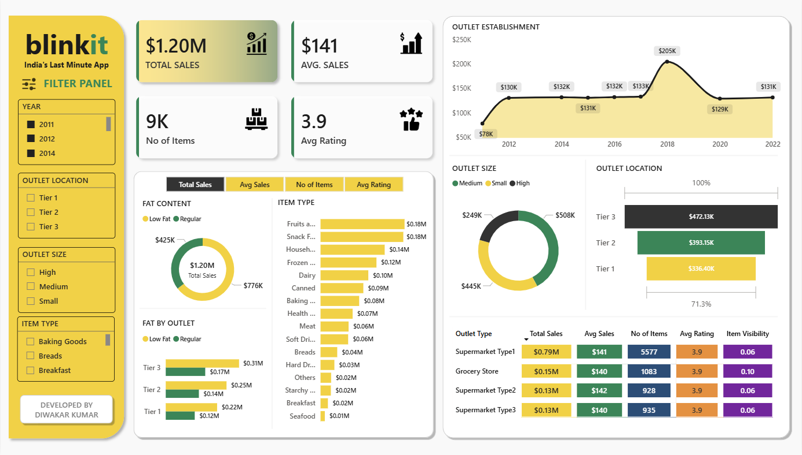
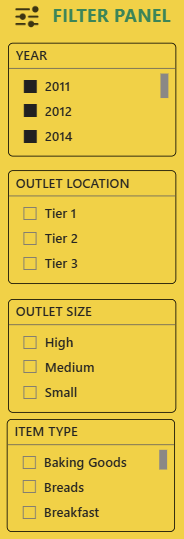
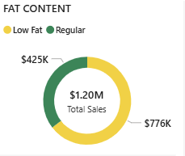
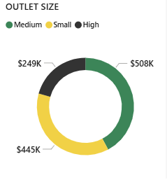
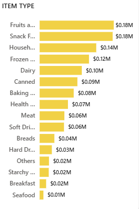
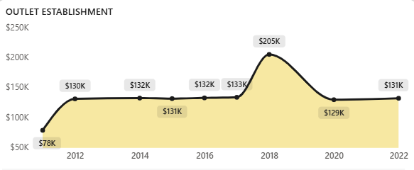
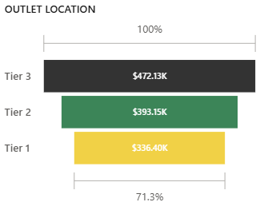
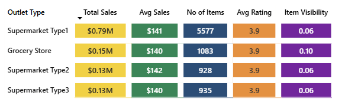
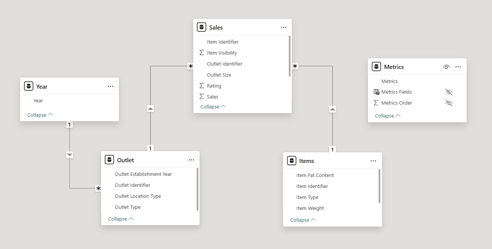

# 🛒 Blinkit Sales Performance Dashboard (Power BI)

This project presents an **interactive sales analytics dashboard** for Blinkit, designed to analyze key business metrics across products, outlets, and customer behavior.  
The dashboard enables **data-driven decision-making** by providing insights into sales trends, product performance, and customer satisfaction.

---

## 🎯 Project Objective

- Analyze sales performance across different outlet types and locations  
- Identify top-performing products and categories  
- Understand customer preferences and ratings  
- Build an interactive dashboard using Power BI  

---

## 📊 Key Performance Indicators (KPIs)

- 💰 **Total Sales:** $1.20M  
- 📈 **Average Sales:** $141  
- 📦 **Number of Items Sold:** 8.5K  
- ⭐ **Average Rating:** 3.9  

---

## 📷 Dashboard Preview

---

## 🎛️ Interactive Filter Panel

The dashboard includes dynamic filters for better analysis:

- Year-wise filtering  
- Outlet Location (Tier 1, Tier 2, Tier 3)  
- Outlet Size (Small, Medium, High)  
- Item Type  

---

## 📊 Visualizations Used

### 🔵 Donut Charts
- Sales by Fat Content  
- Sales by Outlet Size  

 

---

### 🟩 Bar Chart
- Sales by Item Type  

---

### 🟣 Line Chart
- Sales by Outlet Establishment Year  

---

### 🟡 Outlet Location Analysis
- Sales across Tier 1, Tier 2, Tier 3  

---

### 📊 Matrix Table
- Outlet Type vs KPIs  

---

## 🧠 Data Model

Star Schema used:

- Fact Table → Sales Data  
- Dimension Tables → Item, Outlet, Date  

---

## 🛠️ Tools & Technologies

- Power BI  
- DAX  
- Excel  
- Data Modeling  

---

## 📈 Key Insights

- Tier 3 locations generate highest revenue  
- Low Fat products dominate sales  
- Medium outlets perform best  
- Ratings are consistent (~3.9)  
- Older outlets contribute more sales  

---

## 🚀 Business Impact

- Helps track performance  
- Identifies best products  
- Improves decision-making  
- Supports strategy planning  

---

## 📂 Project Structure

Blinkit-Dashboard/
│
├── Data/
│     └── blinkit_dataset.xlsx
│
├── PowerBI/
│     └── blinkit_dashboard.pbix
│
├── images/
│     ├── dashboard_overview.png
│     ├── slicers.png
│     ├── donut_charts.png
│     ├── bar_chart_items.png
│     ├── line_chart.png
│     ├── funnel_chart.png
│     ├── matrix.png
│     ├── data_model.png
│
└── README.md

---

## 👨‍💻 Author

**Diwakar Kumar**

---

## ⭐ Support

If you like this project, give it a ⭐